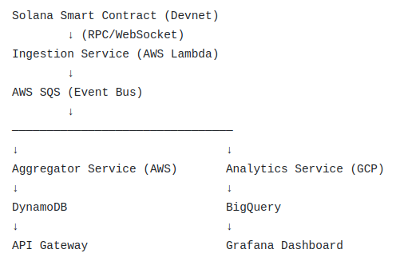

# Chain-to-Cloud Ingestion

## Project Description

**Chain-to-Cloud Ingestion** is a distributed, event-driven system that integrates blockchain events with multi-cloud microservices infrastructure.

A custom Solana smart contract (Devnet) acts as the primary event source. On-chain events are streamed via RPC/WebSocket connections and ingested by an AWS Lambda-based ingestion service. The service publishes normalized event messages to AWS SQS, which functions as the system’s event bus.

Downstream services process events independently:

- **Aggregator Service (AWS)** consumes events from SQS and maintains state projections in DynamoDB.
- **Analytics Service (GCP)** ingests the same event stream for analytical processing and stores data in BigQuery.
- **API Gateway** exposes read models to external clients.
- **Grafana** provides cross-cloud observability and system metrics.

The architecture emphasizes:

- Blockchain as an immutable event source  
- Serverless ingestion layer  
- Event-driven microservices  
- Cross-cloud workload distribution (AWS + GCP)  
- Separation of read models and analytical pipelines  
- Production-style observability  

This project demonstrates how blockchain can be integrated into modern cloud-native architectures as a first-class event stream within a scalable, loosely coupled system.

## Architecture Overview

